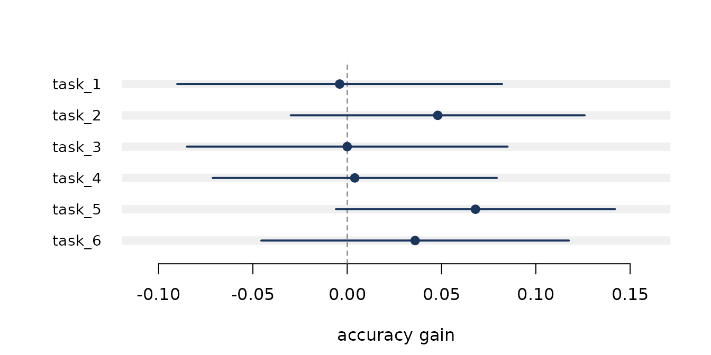

# Getting started with evaluatellm

``` r

library(evaluatellm)
```

An evaluation is an experiment. It draws a sample of questions from the
much larger set of questions someone could have written, runs a model on
them, and reports a mean. Like any experiment it has a standard error,
and like any experiment it can be too small to answer the question it
was built to answer.

This vignette walks through the workflow on a simulated reading
comprehension evaluation: 50 passages, 8 questions each, two models.

## Building the evaluation object

Passages differ in difficulty, and every question about a passage
inherits that difficulty. This is what makes the questions dependent.

``` r

passage_difficulty <- rnorm(50, 0, 1.3)
item_difficulty <- rep(passage_difficulty, each = 8) + rnorm(400, 0, 0.4)

skill <- c(new = 0.95, old = 0.72)
results <- do.call(rbind, lapply(names(skill), function(m) {
  data.frame(
    q       = 1:400,
    passage = rep(1:50, each = 8),
    model   = m,
    correct = rbinom(400, 1, plogis(skill[[m]] - item_difficulty))
  )
}))

e <- as_eval(results, score = correct, item = q, model = model,
             cluster = passage)
e
#> <evaluatellm_eval>
#>   rows    800
#>   items   400
#>   models  2 (new, old)
#>   clusters 50
```

Declaring `cluster` is the single most consequential argument in the
package. Everything downstream uses it.

## Scoring one model

``` r

ev_score(e, "new")
#> 
#> Evaluation score: new
#> 
#>   Estimate   0.6950
#>   Std. error 0.0401
#>   95% CI     [0.6144, 0.7756]
#> 
#>   Items      400
#>   Clusters   50
#>   Design eff 3.03 (SE is 1.74x the independent estimate)
#>   Cluster-robust standard error, t on 49 df.
```

The design effect says the cluster-robust standard error is three times
the variance of the naive one. Turning the cluster correction off shows
what would otherwise have been reported:

``` r

ev_score(e, "new", cluster = FALSE)
#> 
#> Evaluation score: new
#> 
#>   Estimate   0.6950
#>   Std. error 0.0230
#>   95% CI     [0.6497, 0.7403]
#> 
#>   Items      400
#>   Independent standard error, t on 399 df.
```

Same estimate, an interval roughly 40 per cent too narrow.
[`ev_cluster()`](https://charlescoverdale.github.io/evaluatellm/reference/ev_cluster.md)
breaks this down further, and
[`ev_icc()`](https://charlescoverdale.github.io/evaluatellm/reference/ev_icc.md)
returns the intra-cluster correlation on its own, which is what you need
to plan the next evaluation.

``` r

ev_icc(e, "new")
#> [1] 0.287668
#> attr(,"raw")
#> [1] 0.287668
```

## Comparing two models

Both models answered the same questions, so the comparison should be
paired.

``` r

ev_paired(e, model_a = "new", model_b = "old")
#> 
#> Paired comparison: new vs old
#> 
#>   new  0.6950
#>   old  0.6350
#> 
#>   Difference   0.0600  [-0.0035, 0.1235] (p = 0.063)
#>   Std. error   0.0316  (cluster-robust, 50 clusters)
#>   t = 1.899 on 49 df
#> 
#>   Items        400
#>   Correlation  0.163
#>   Pairing cut the variance by 1.1x versus an unpaired comparison
#>   (unpaired SE would be 0.0333).
```

Two things are worth reading here. The correlation between the models’
item scores drives the variance reduction from pairing: the more alike
the models, the more pairing buys. And the difference is far less
affected by clustering than the level was, because taking the difference
has already removed the passage difficulty both models faced.

For models run on different question sets,
[`ev_unpaired()`](https://charlescoverdale.github.io/evaluatellm/reference/ev_unpaired.md)
gives a Welch interval, at a real cost in power.

## Sizing an evaluation before running it

Run this first, not last.

``` r

ev_mde(n_items = 400, p_a = 0.72, p_b = 0.70, correlation = 0.7,
       icc = 0.25, cluster_size = 8)
#> 
#> Minimum detectable effect
#> 
#>   MDE            0.0816
#> 
#>   Questions      400 (effective 145)
#>   SD of diff     0.3515 (binary scores)
#>   Power          80%
#>   Alpha          0.05 two-sided
#>   Design effect  2.75
#> 
#>   A true difference below 0.0816 will usually be missed.
```

Four hundred clustered questions cannot resolve a two point gap. A null
result from this evaluation would say nothing about the models. To find
the size that would work:

``` r

ev_power(delta = 0.02, p_a = 0.72, p_b = 0.70, correlation = 0.7,
         icc = 0.25, cluster_size = 8)
#> 
#> Evaluation size required
#> 
#>   Questions      6667
#>   Clusters       834 of 8
#> 
#>   To detect      0.0200
#>   SD of diff     0.3515 (binary scores)
#>   Power          80%
#>   Alpha          0.05 two-sided
#>   Design effect  2.75 (ICC 0.25, 8 per cluster)
#> 
#>   Clustering costs 4243 extra questions.
```

The best source for `sd_diff` is a pilot run passed back through
`pilot =`.

## Several responses per question

Sampling `k` responses per question splits the observed spread into
genuine variation between questions and noise in the model’s own
sampling.

``` r

p_i <- plogis(rnorm(200, 0.7, 1.1))
rep_d <- data.frame(
  q    = rep(1:200, each = 6),
  draw = rep(1:6, times = 200),
  s    = rbinom(1200, 1, rep(p_i, each = 6))
)
ev_resample(as_eval(rep_d, score = s, item = q, sample = draw))
#> 
#> Repeated-sampling variance decomposition: model
#> 
#>   Estimate     0.6825
#>   Std. error   0.0193
#>   95% CI       [0.6444, 0.7206]
#> 
#>   Items        200
#>   Responses    1200 (mean k = 6.0)
#> 
#>   Var between  0.0462
#>   Var within   0.171
#>   Share of observed spread that is sampling noise: 38%
#> 
#>   Projected standard error by responses per item:
#> 
#>     k =    1   SE 0.0329   (200 responses)
#>     k =    2   SE 0.0257   (400 responses)
#>     k =    4   SE 0.0211   (800 responses)
#>     k =    8   SE 0.0184   (1600 responses)
#>     k =   16   SE 0.0169   (3200 responses)
#>     k =  Inf   SE 0.0152   (floor)
#> 
#>   More responses per item cannot beat SE 0.0152.
#>   Going below that requires more items.
```

The projection table is the useful part: more responses per question
buys precision only against the within-question term, and there is a
floor no amount of resampling can beat. Getting below it means writing
more questions.

## Evaluations graded by a model judge

A judge is cheap and biased. Bias does not shrink as you grade more
items, so measure it first.

``` r

truth <- rbinom(500, 1, 0.55)
judge_pilot <- truth
judge_pilot[truth == 0] <- rbinom(sum(truth == 0), 1, 0.35)
ev_judge_agreement(judge_pilot, truth)
#> 
#> Judge agreement (binary, n = 500)
#> 
#>   Mean judge   0.6820
#>   Mean human   0.5460
#> 
#>   Agreement    0.864  [0.831, 0.891]
#>   Kappa        0.719  [0.659, 0.778]
#>   Sensitivity  1.000
#>   Specificity  0.700
#>   Correlation  0.749
#> 
#>   Bias         0.1360  [0.1059, 0.1661] (p < 0.001)
#>   McNemar      chi-sq 66.01 (p < 0.001)
#>                judge higher on 68 items, lower on 0
#> 
#>   The judge is systematically generous. Every score it grades inherits this.
#>   Correct it with ev_judge_debias() rather than reprompting.
```

Read the kappa rather than the raw agreement, and take the McNemar test
seriously: a judge whose errors run one way is putting that error into
every score it grades.

The fix is not a better prompt. Grade everything with the judge, label a
random subset by hand, and combine them.

``` r

n_total <- 5000
truth_all <- rbinom(n_total, 1, 0.62)
judge <- ifelse(runif(n_total) < 0.87, truth_all, 1 - truth_all)
judge[truth_all == 0 & runif(n_total) < 0.15] <- 1

gold <- rep(NA_real_, n_total)
labelled <- sample(n_total, 250)
gold[labelled] <- truth_all[labelled]

ev_judge_debias(judge, gold)
#> 
#> Prediction-powered evaluation score
#> 
#>   Estimate     0.6055  [0.5644, 0.6465]
#>   Std. error   0.0209
#> 
#>   For comparison:
#>     humans only    0.6200  (SE 0.0308)
#>     judge only     0.6290  (biased by 0.0280)
#> 
#>   Items        5000 judged, 250 human-labelled
#>   Lambda       0.726 (tuned)
#>   Correlation  0.752
#> 
#>   Your 250 human labels carry the precision of 539.
```

The estimator is unbiased for any tuning constant, so no assumption
about judge quality is being smuggled in, and the default tuning
guarantees it is never less precise than ignoring the judge entirely. To
size the labelling budget in advance:

``` r

ev_judge_power(n_total = 20000, correlation = 0.8, target_se = 0.01)
#> 
#> Human labels required
#> 
#>   Human labels     979
#>   Without a judge  2500
#>   Saving           61%
#> 
#>   Target SE        0.0100
#>   Achieved SE      0.0100
#>   Judge-scored     20000
#>   Correlation      0.80
#>   Lambda           0.761
```

## Suites and leaderboards

Reporting the tasks a model won, out of the tasks it was tried on, needs
a multiplicity adjustment.
[`ev_multi()`](https://charlescoverdale.github.io/evaluatellm/reference/ev_multi.md)
applies one, pools the tasks by inverse variance, and tests whether they
are telling the same story.

``` r

suite <- lapply(1:6, function(i) {
  a <- rbinom(250, 1, 0.72)
  b <- rbinom(250, 1, 0.68)
  d <- data.frame(q = rep(1:250, 2), m = rep(c("new", "old"), each = 250),
                  s = c(a, b))
  ev_paired(as_eval(d, score = s, item = q, model = m), "new", "old")
})
names(suite) <- paste0("task_", 1:6)
ev_multi(suite)
#> 
#> Benchmark suite: 6 tasks
#> 
#>   task    estimate       95% CI        p     p.adj
#>   task_1   -0.0040  [-0.0901, 0.0821]   0.927  1.000
#>   task_2    0.0480  [-0.0299, 0.1259]   0.226  1.000
#>   task_3    0.0000  [-0.0850, 0.0850]   1.000  1.000
#>   task_4    0.0040  [-0.0713, 0.0793]   0.917  1.000
#>   task_5    0.0680  [-0.0060, 0.1420]   0.071  0.429
#>   task_6    0.0360  [-0.0455, 0.1175]   0.385  1.000
#> 
#>   Adjustment    holm (0 of 6 survive, 0 nominal)
#> 
#>   Pooled        0.0273  [-0.0050, 0.0597] (p = 0.097)
#>   Heterogeneity Q = 2.78 on 5 df (p = 0.735), I2 = 0%
```

For leaderboards,
[`ev_rank()`](https://charlescoverdale.github.io/evaluatellm/reference/ev_rank.md)
bootstraps the ordering so you can see which positions the data actually
support, and
[`ev_elo()`](https://charlescoverdale.github.io/evaluatellm/reference/ev_elo.md)
fits Bradley-Terry ratings with standard errors on pairwise preference
data.

## Reporting

[`ev_table()`](https://charlescoverdale.github.io/evaluatellm/reference/ev_table.md)
flattens results into a data frame and
[`ev_plot()`](https://charlescoverdale.github.io/evaluatellm/reference/ev_plot.md)
draws them.

``` r

ev_plot(suite, reference = 0, xlab = "accuracy gain")
```


